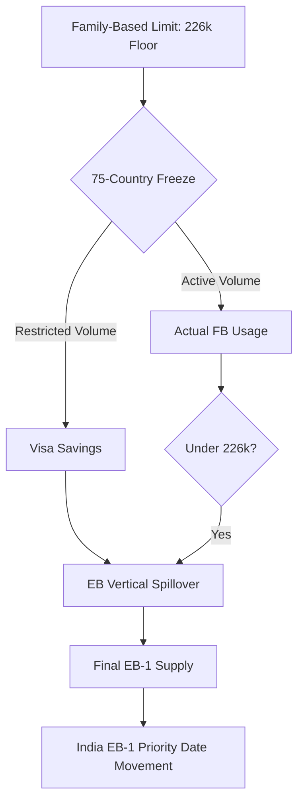

# The Spillover Engine 📈

A production-ready Streamlit application to visualize and predict the impact of the 2026/2027 U.S. Immigrant Visa restrictions on the India EB-1 backlog.

## Features
- **Waterfall Visualization**: Path from FB Statutory Limit to Final EB-1 Supply.
- **75-Country Freeze**: Logic to redistribute savings from restricted countries.
- **Mountain vs Valley Analysis**: India EB-1 inventory breakdown.
- **PD Predictor**: Confidence scoring for Priority Date approvals in FY 2027.

## INA 201/203 Spillover Flow (Freeze Mode)



## Setup & Installation

### Local Development
1. Install dependencies:
   ```bash
   pip install -r requirements.txt
   ```
2. Generate mock data:
   ```bash
   python generate_mock_data.py
   ```
3. Run the app:
   ```bash
   streamlit run app/Home.py
   ```

### Docker
1. Build and run:
   ```bash
   docker-compose up --build
   ```
2. Access the app at `http://localhost:8501`.

## Documentation
- [Architecture & Design](docs/ARCHITECTURE.md)
