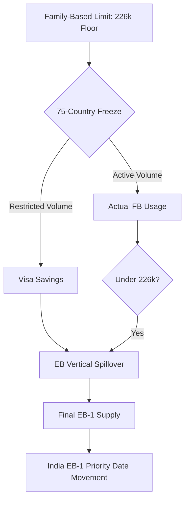

# The Spillover Engine 🇺🇸 📈

A modern web application to visualize and predict the impact of hypothetical U.S. Immigrant Visa restrictions on the India EB-1 backlog (INA 201/203 spillover modeling, revamped 2026 with current Visa Bulletin data).

## Stack
- **Backend**: FastAPI (Python)
- **Frontend**: Next.js (React), Tailwind CSS, shadcn/ui
- **Data**: Pandas, Recharts

## Features
- **Waterfall Visualization**: INA-compliant path from FB/EB limits to India EB-1 supply (with/without Restriction Scenario).
- **Hypothetical Restriction Scenario**: Configurable 75-country demand freeze savings + EB4/5 roll-up to EB-1 (research: not enacted as of 2026; India excluded from restricted).
- **Inventory + Pipeline**: Auto-discovered latest USCIS EB I-485 + I-140 files (drop new eb_inventory_*.xlsx or performance data into data/ — no code change), 2.2x dependents.
- **PD Predictor**: FY2027 confidence with high-supply blend + backlog_ahead by PD year.

## INA 201/203 Spillover Flow (Freeze Mode)



## Setup & Installation

### Local Development

#### 1. Backend (FastAPI)
```bash
# Install dependencies
pip install -r requirements.txt

# Run API
uvicorn api.main:app --reload
```
Access API docs at `http://localhost:8000/docs`.

#### 2. Frontend (Next.js)
```bash
cd frontend
npm install
npm run dev
```
Access the app at `http://localhost:3000`.

### Docker
1. Build and run:
   ```bash
   docker-compose up --build
   ```
2. Access the app at `http://localhost:3000`.

## Documentation
- [Architecture & Design](docs/ARCHITECTURE.md)
